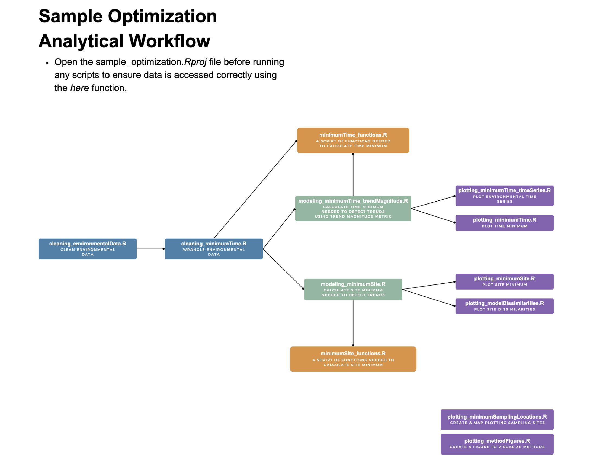

# Minimum Sampling, Maximum Insight: Tracking Environmental Trends in a Tidal Estuary

Barbara Spiecker1, Kalle Matso2, Chris Whitney2, Easton R. White1

1Department of Biological Sciences, University of New Hampshire, Durham, New Hampshire, USA 03824.
2Piscataqua Region Estuaries Partnership, University of New Hampshire, Durham, New Hampshire, USA 03824.

*Corresponding Author: Barbara Spiecker (barbara.spiecker@gmail.com)

This repository contains code for a paper focused on optimizing monitoring programs in dynamic estuary systems. 

The code is broadly organized with the following workflow.

